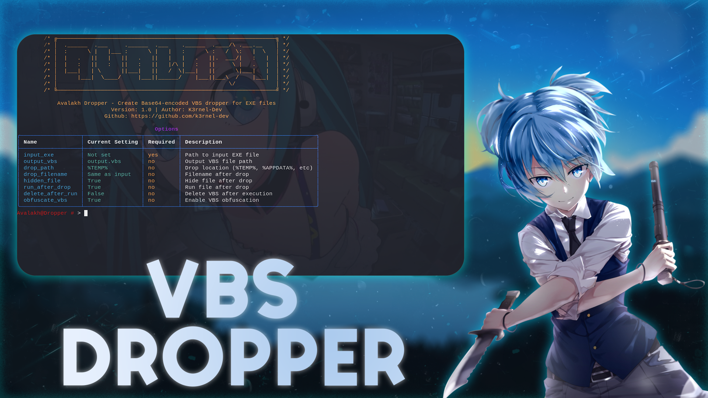
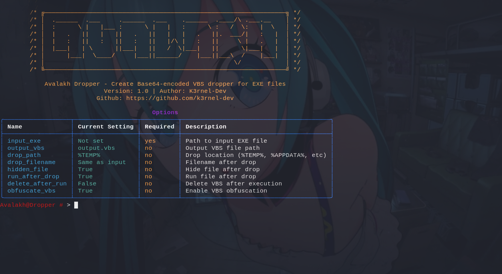
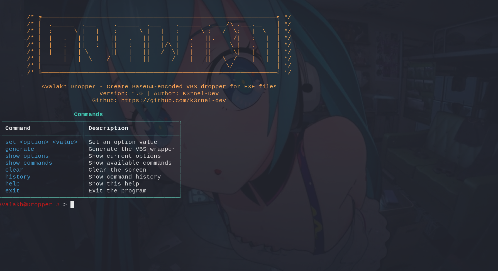
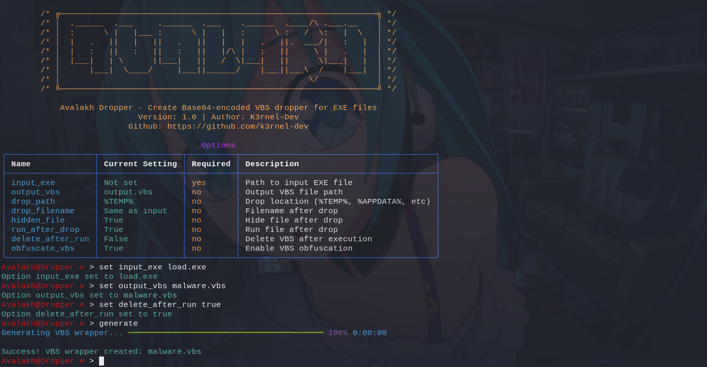
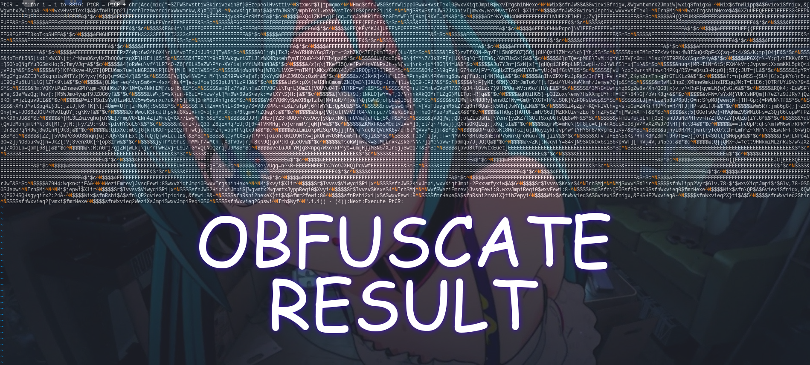
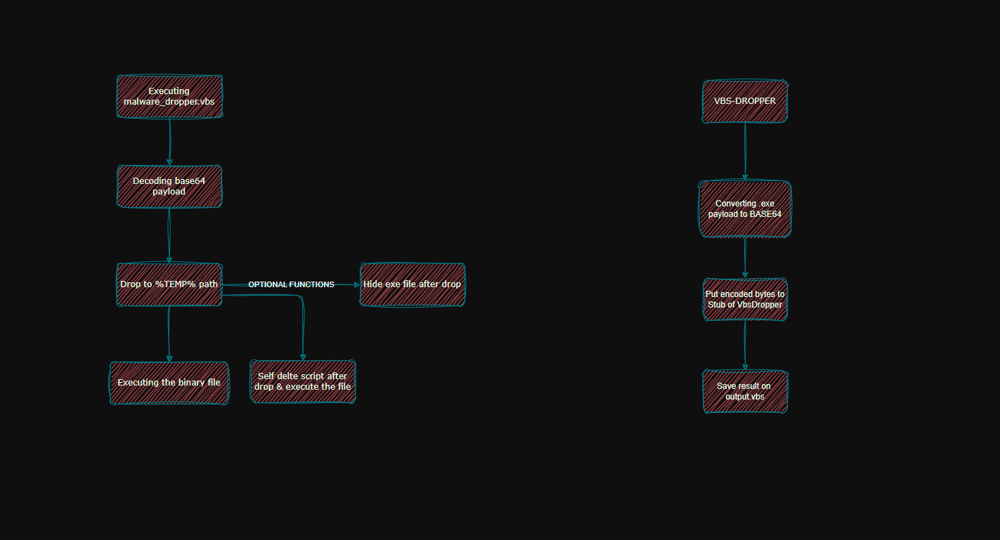

# ⭐ <b>A V A L A K H - D R O P P E R</b>

> 

# 📒 About 
> Implementation of a malicious dropper of your executable bytes under VBS scriptlets, with some minor functions. The essence of the implementation is quite trivial, your executable file is encoded in base64 format and placed in the dropper stub, and actually when launched it is decoded and depending on the options it is decided where it will be extracted and launched. The script also has support for obfuscation of the final dropper. More details below.

<br>

# ⚙️ Features
- ⚔️ **Payload encoding**: Malware Bytes encoded to base64.
- 🛡️ **Hide-File**: Method of hiding a file after dropping it on a physical disk.
- 🔒 **Obfuscation-Engine**: Obfuscation engine for final vbs-stub.
<br>

## 📸 **Screens**

> 
> 
> 
> 

<br>

## 🌴 **Work graph**
>

<br>

### 🧬 Requirements
```diff 
colorama
rich
```

## ⚠️ **Disclaimer**
```
This project is for educational purposes only, intended for studying malware and security techniques. The author is not responsible for any malicious use of this software.
```
<br>

# ⭐ Credits 

- **Author**: <a href="https://github.com/k3rnel-dev">@K3rnel-Dev</a>
---